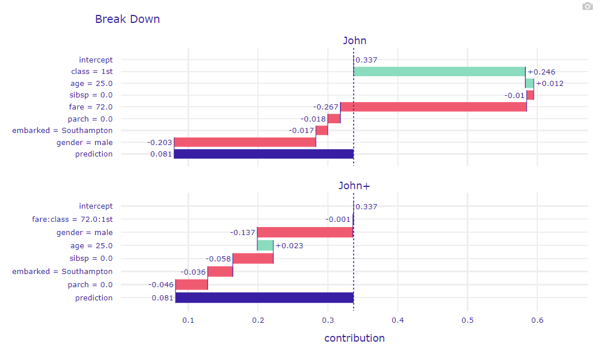
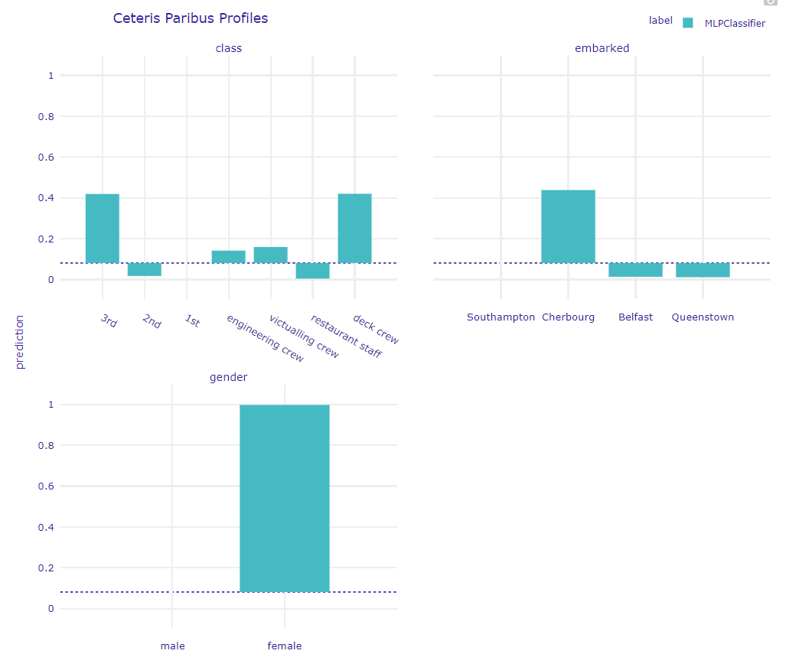
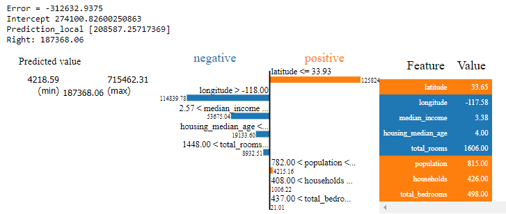

# MLLib
commonly use machine learning library for use in day to day analysis and model building

### Classification

Titanic dataset , to predict the survivability of passenger with different attribute.

In this simple example , DALEX has been used to show the model explainer for black box like multi-layer perceptron.

Model explainer to explain the feature of why this value is being propose.

Below is the whatif we would want to flip the survibility of John, which feature adjustment could make the highest impact.

### Regression
* Xgboost regressor with model explainer for california housing price data
* Added SHAP and LIME different model explainer as part of understanding for each data points, feature that has been used for prediction and value

### Reinforcement Learning
* PONG REINFORCE BASE CODE for pong game

__Monte-Carlo Tree Search__

Training an agent using the concept of what Alpha-go has deployed on Tic-Tac-Toe.
Can you beat the agent in Tic-Tac-Toe game when it has completely master the game ? Please try out MCTS method.

### Time Series Analysis
* Air passenger base code for analysis using:
- Post processing of air passenger trend into stationarity
- ETS (Error Trend Seasonal) decomposition
- Moving Average trend

### Dataset
* California housing price dataset

### Deep Learning Basics
* Pytorch basics on how to setup tensor for regression and classification.

### KaggleCompetition
* Jane Market Prediction  - Xgboost prediction method.
26/11 Jane Street Market prediction added with grid_search and code to run xgboost in GPU. Results in prediction on true positive (buy)
is low, could further improve with grid search with hyper parameter tuning.

29/11 Jane Street Market with full data processed get scores of 100 using partial tuned model with subsample data. Require to further explore on the feature to improve on the time series analysis.

12/12
* 1. Jane Market to analyze feature through looking at tagging map 
* 2. Using dabl , data analysis baseline
